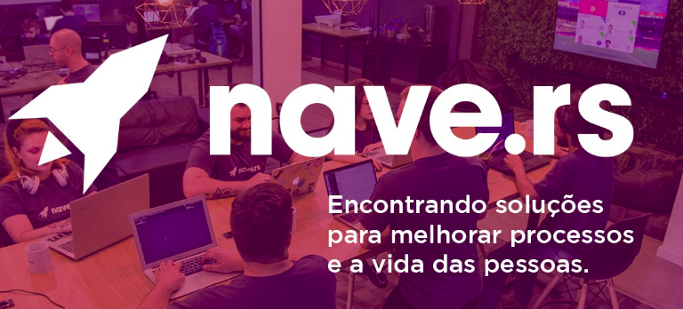

<p align="center">
  

  

  <a href="https://github.com/stilljag/Navedex-API/commits/main">
    
  </a>
    
   
   <a href="https://github.com/stilljag/Navedex-API/stargazers">
    
  </a>

  <a href="https://nave.rs/">
    
  </a>
  
  <a href="https://nave-team.gupy.io/">
    
    </a>
    
  <div align="center" style="margin-bottom: 20px;">

</div>
<div align="center">
 
</p>


<h4 align="center"> 
	🚧  Navedex's  🚀 Concluído 🚀 🚧
</h4>

<p align="center">
 <a href="#-sobre-o-projeto">Sobre</a> •
 <a href="#-funcionalidades">Funcionalidades</a> • 
 <a href="#-como-executar-o-projeto">Como executar</a> • 
 <a href="#-tecnologias">Tecnologias</a> •  
 <a href="#-autor">Autor</a> • 
 <a href="#user-content--licença">Licença</a>
</p>

## 💻 Sobre o projeto

🚀 Navedex's - é um sistema que consiste em um criador de navedex's, permitindo assim o cadastro em um banco de dados estruturado dos naver's com os projetos que fazem parte.

A API foi um desafio prosposto durante o processo seletivo da [Nave](https://nave.rs/), compondo a 3ª fase do processo, o Teste Técnico, com o objetivo de conhecer um pouco melhor o nível técnico dos candidatos.

---

## ⚙️ Funcionalidades

- [x] Cadastro de usuários para gerenciar a API:

  - [x] Autenticação JWT,
  - [x] Rotas com controle de acesso

- [x] Cadastramento dos Naver's e dos projetos
  - [x] CRUD simples e funcional
  - [x] Filtros por nome, data de admissão ou job

---

## 🚀 Como executar o projeto

```bash

# Clone este repositório
$ git clone git@github.com:stilljag/Navedex-API.git

# Acesse a pasta do projeto no terminal/cmd
$ cd Navedex-API

# Instale as dependências
$ yarn

# Crie na pasta raiz da API o arquivo .env
$ SECRET=df55340f75b5da454e1c189d56d7f31b
$ DECODED=

# Execute as migrations
$ yarn typeorm migration:run

# Rode a API
$ yarn dev

# O servidor inciará na porta:3333 -

```

<p align="center">
  <a href="https://github.com/stilljag/Navedex-API/blob/main/Insomnia-Navidex" target="_blank"></a>
</p>

---

## 🛠 Tecnologias

Foi utilizado na aplicação as seguintes tecnologias

##### [](https://github.com/stilljag/Navedex-API#backend-nodejs--typescript)**Backend** ([NodeJS](https://nodejs.org/en/) + [TypeScript](https://www.typescriptlang.org/))

- **[Express](https://expressjs.com/)**
- **[KnexJS](http://knexjs.org/)**
- **[SQLite](https://github.com/mapbox/node-sqlite3)**
- **[Typeorm](https://typeorm.io/#/)**
- **[JWT](https://jwt.io/)**
- **[UUID](https://www.uuidgenerator.net/)**
- **[ts-node](https://github.com/TypeStrong/ts-node)**
- **[dotENV](https://github.com/motdotla/dotenv)**

---

## 💪 Como contribuir para o projeto

1. Faça um **fork** do projeto.
2. Crie uma nova branch com as suas alterações: `git checkout -b my-feature`
3. Salve as alterações e crie uma mensagem de commit contando o que você fez: `git commit -m "feature: My new feature"`
4. Envie as suas alterações: `git push origin my-feature`
   > Caso tenha alguma dúvida confira este [guia de como contribuir no GitHub](./CONTRIBUTING.md)

---

## 🦸 Autor

<a href="https://github.com/stilljag/">
 
 <br />
 <sub><b>William Ribeiro/b></sub></a> <a href="https://blog.rocketseat.com.br/author/thiago/" title="AlunoRocketseat">🚀</a>
 <br />

[](https://www.linkedin.com/in/william-ribeiro-0b5ab911a/)
[](mailto:sbrdigital15@gmail.com)

---

## 📝 Licença

Este projeto esta sobe a licença [MIT](./LICENSE).

---
